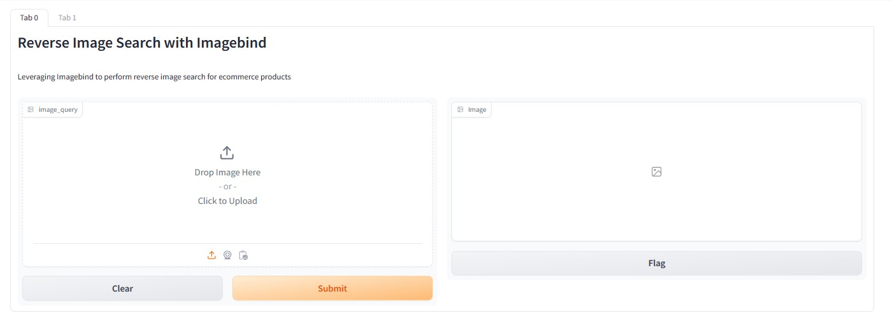
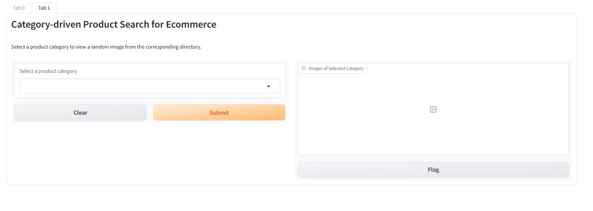

# Performing Image-Driven Reverse Image Search for E-Commerce products.
## Building a Reverse Image Product Search application using Qdrant Similarity Search, Meta's ImagBind and Gradio.
The dataset is taken from Kaggle which is an Ecommerce Product Image dataset. You can visit this [file](data.txt) to see the dataset and construct the files accordingly. 

Clone this repository and install the [dependencies](requirements.txt).

To install the ImageBind, follow the instructions given in this [file](Imagebind.txt).

Run the Python [file](app.py).
There are two Gradio Interfaces:
1. Reverse Image Product Search with ImageBind
2. Image Search using Product Category
   
You'll see the running application in two tabs.

**Tab 0:** 
**Tab 1:** 

Try a reverse image search by uploading an image and getting images of the products from the selected product categories.
For more details, visit my medium [article]()
